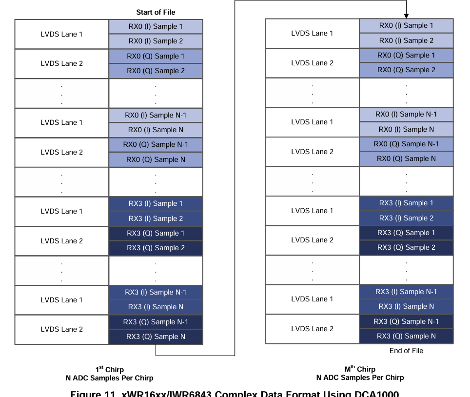

# ch0: Read and organize the raw adc data

Hardware: TI IWR6843ISK

According to [Mmwave Radar Device ADC Raw Data Capture](https://www.ti.com.cn/lit/an/swra581b/swra581b.pdf?ts=1774154882296&ref_url=https%253A%252F%252Fcn.bing.com%252F)



So the ADC data layout follows the LVDS Lane 2 format:
[I1, I2, Q1, Q2 ....]

Therefore, we should combine four raw values (I1, I2, Q1, Q2) into two complex sample points.

```text
  _______
 |       |
I1, I2, Q1, Q2 ....
     |______|
```


```c
// mmwave.c
int read_adc_to_frames(FILE *in, Complex *out, RadarConfig *config) {
  // ....

    for (int i = 0; i + 3 < raw_samples_per_frame; i += 4) {

      frame_ptr[samples_idx][0] = raw_buffer[i];       // I1
      frame_ptr[samples_idx++][1] = raw_buffer[i + 2]; // Q1

      frame_ptr[samples_idx][0] = raw_buffer[i + 1];   // I2
      frame_ptr[samples_idx++][1] = raw_buffer[i + 3]; // Q2
    }

  // ....
}
```

Then we got the frame data layout follows the [frames, chirps, rx, samples]

# example

more details in `./main.c` and `mmwave.c`

run `make ch0` in **project root path** to check result

